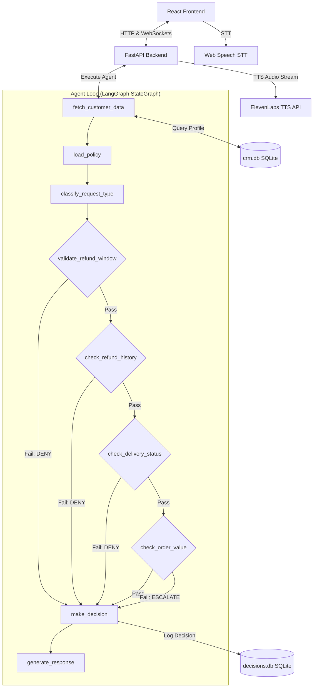

# AI Refund Auditor

## About
* **Description**: AI Customer Support Agent — LangGraph + FastAPI + React + Voice Pipeline for e-commerce refund processing
* **Topics**: langgraph, fastapi, react, python, ai-agent, llm, websocket, elevenlabs, sqlite

An advanced, production-quality AI Customer Support Agent designed to process or deny e-commerce refund requests. It automatically audits customer profile data against a strict company policy document using LangGraph, writes decisions to an admin ledger, streams real-time reasoning logs via WebSockets, and offers voice integration via speech-to-text (STT) and text-to-speech (TTS).

---

## System Architecture



---

## Tech Stack

| Layer | Technology | Purpose |
| :--- | :--- | :--- |
| **Backend Framework** | Python + FastAPI | High-performance API hosting and WebSocket routing |
| **Agent Orchestration**| LangGraph | State machine managing execution nodes & conditional routing |
| **LLM Model** | 3-Tier Resilient LLM Stack | Gemini 2.5 Flash → Ollama (qwen2.5:3b) → Deterministic fallback |
| **Databases** | SQLite | Mock CRM database (`crm.db`) and audit ledger (`decisions.db`) |
| **Frontend UI** | React + Vite + Tailwind CSS | Screen-fit dark mode dashboard with animated audio waveforms |
| **Voice Pipelines** | Web Speech API + ElevenLabs | Free browser speech-to-text and high-fidelity text-to-speech |

---

## Project Structure

```
.
├── refund-agent/
│   ├── backend/
│   │   ├── agent/           # LangGraph StateGraph, nodes, and tool definitions
│   │   ├── data/            # SQLite CRM databases & seed script
│   │   ├── main.py          # FastAPI application server
│   │   ├── requirements.txt # Python package requirements
│   │   └── test_agent.py    # Automated test cases
│   ├── frontend/
│   │   ├── src/             # React App components and hooks
│   │   ├── package.json     # Node modules definitions
│   │   └── index.html       # Web client entrypoint
│   ├── docker-compose.yml   # Multi-service docker configuration
│   └── Makefile             # Command shortcut recipes
└── README.md                # Root project documentation
```

---

## Setup & Running the App

### Option A: Local Run (Make/Subprocesses)
1. Export environment keys:
   ```bash
   export GEMINI_API_KEY="your-key"
   ```
2. Start dev servers:
   ```bash
   make dev
   ```

### Option B: Docker Compose
Launch both backend and frontend services containerized:
```bash
docker-compose up --build
```
Navigate to [http://localhost:5173](http://localhost:5173) in your browser.
