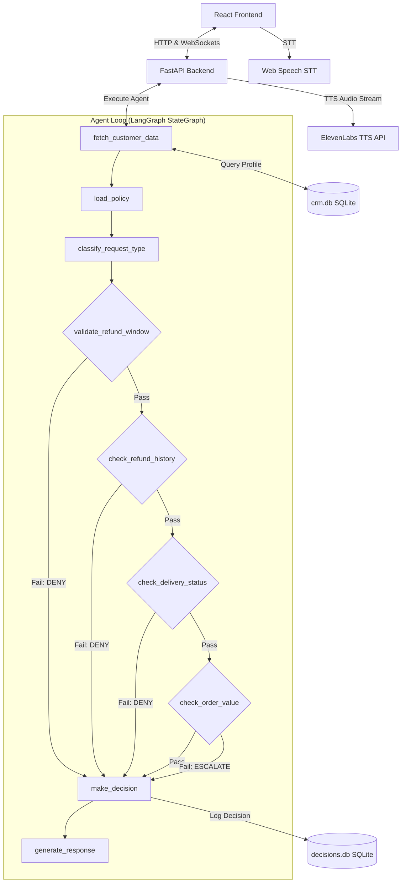

# AI Customer Support Agent for E-Commerce Refunds

An advanced, production-quality full-stack AI Customer Support Agent designed to process or deny e-commerce refund requests. It automatically audits customer profile data against a strict company policy document using LangGraph, writes decisions to an admin ledger, streams real-time reasoning logs via WebSockets, and offers voice integration via speech-to-text (STT) and text-to-speech (TTS).

---

## System Architecture



---

## Tech Stack

| Layer | Technology | Purpose |
| :--- | :--- | :--- |
| **Backend Framework** | Python + FastAPI | High-performance API hosting and WebSocket routing |
| **Agent Orchestration**| LangGraph | State machine managing execution nodes & conditional routing |
| **LLM Model** | 3-Tier Resilient LLM Stack | Gemini 1.5 Flash → Ollama (qwen2.5:3b) → Deterministic fallback |
| **Databases** | SQLite | Mock CRM database (`crm.db`) and audit ledger (`decisions.db`) |
| **Frontend UI** | React + Vite + Tailwind CSS | Double-panel dark mode dashboard with animated micro-effects |
| **Voice Pipelines** | Web Speech API + ElevenLabs | Free browser speech-to-text and high-fidelity text-to-speech |
| **Deployment** | Docker Compose / Makefile | Concurrent backend & frontend service packaging |

---

## Setup & Running the App

### Prerequisites
- Python 3.11+
- Node.js 20+
- A Google Gemini API Key
- *Optional:* Local Ollama running with `qwen2.5:3b` model
- *Optional:* ElevenLabs API Key (for high-fidelity voice TTS playback)

### Environment Configuration
Create a `.env` file inside the root directory or `backend/` directory:
```env
GEMINI_API_KEY=your_gemini_api_key_here
ELEVENLABS_API_KEY=your_elevenlabs_api_key_here
```
> [!TIP]
> If neither `GEMINI_API_KEY` is provided nor Ollama is running, the agent will gracefully enter **Fidelity Mock Mode**, utilizing the deterministic policy engine to simulate audits so that the app remains functional and testable out of the box.

### Run with Local Package Managers
1. Install dependencies:
   ```bash
   make install
   ```
2. Start the development servers (FastAPI + Vite React):
   ```bash
   make dev
   ```
3. Open your browser on [http://localhost:5173](http://localhost:5173).

### Run with Docker Compose
If you prefer running inside containers with a single command:
```bash
docker-compose up --build
```
Open [http://localhost:5173](http://localhost:5173) to view the dashboard.

## 3-Tier Resilient LLM Stack

To guarantee that the application is production-quality, bulletproof, and demo-ready, it utilizes a custom **3-Tier Resilient LLM Stack** for all intelligence nodes (Intent Classification, Policy Compliance Auditing, and Response Generation):

1. **Tier 1: Google Gemini 1.5 Flash (Primary)**
   - The primary engine. Fast, accurate, and free tier. Queried directly via HTTP calls to minimize dependency footprint.
2. **Tier 2: Local Ollama with `qwen2.5:3b` (Secondary Fallback)**
   - If Gemini rate limits are hit (HTTP 429), connection timeouts happen, or API key errors occur, the backend dynamically falls back to a locally hosted Ollama instance running the `qwen2.5:3b` model.
3. **Tier 3: Local Deterministic Policy Engine (Mock Mode / Final Fallback)**
   - If both the Gemini API is offline/rate-limited AND the local Ollama instance is unavailable, the system automatically falls back to a deterministic local rule compliance validator and template engine.
   - **Crucially, the system never crashes during a demo**, even when completely offline.

### Real-Time Fallback Stream
All fallback events are dynamically logged and streamed in real-time to the reasoning log in the Admin Dashboard with a prominent `[FALLBACK]` badge:
- `[FALLBACK] Gemini rate limit → Ollama (Gemini API rate limit (429) hit)`
- `[FALLBACK] Gemini key missing → Ollama (Gemini API key is not configured)`
- `[FALLBACK] Ollama connection failed → Deterministic fallback (Ollama connection failed)`

---

## Sample Test Case Audits

The system comes pre-seeded with 15 customer profiles covering every policy exception:

| Customer ID | Customer Name | Scenario | Expected Decision | Policy Clause |
| :--- | :--- | :--- | :--- | :--- |
| **CUST001** | Alice Smith | Delivered 5 days ago, 0 prior refunds | **APPROVE** | All criteria met |
| **CUST002** | Bob Jones | Delivered 35 days ago | **DENY** | Clause 1 (Past 30 days) |
| **CUST003** | Charlie Brown | Order is in transit | **DENY** | Clause 5 (Not delivered) |
| **CUST004** | Diana Prince | 3 prior refunds in history | **DENY** | Clause 2 (Abuse limit met) |
| **CUST005** | Ethan Hunt | COD order, return not initiated | **DENY** | Clause 3 (Return needed) |
| **CUST006** | Fiona Gallagher | Damaged item, customer keeping item | **PARTIAL** | Clause 7 (50% refund) |
| **CUST007** | George Clark | Order value is ₹12,000 | **ESCALATE** | Clause 4 (Value > ₹10,000) |
| **CUST008** | Hannah Abbott | Cancelled before shipment | **APPROVE** | Clause 8 (Auto-cancel) |
| **CUST009** | Ian Malcolm | Software license (Digital product) | **DENY** | Clause 6 (Non-refundable) |
| **CUST010** | Julia Roberts | COD order, return completed | **APPROVE** | Clause 3 (Return completed) |
| **CUST011** | Kevin Bacon | Completed order marked as disputed | **ESCALATE** | Status Dispute Escalation |
| **CUST012** | Laura Croft | Past window & 3 prior refunds | **DENY** | Clause 1 & 2 violations |

To run the automated script that tests all 15 customer IDs against the StateGraph:
```bash
make test
```

---

## Known Limitations & Future Improvements
1. **Human-in-the-Loop Integration**: Currently, escalated requests are marked as `ESCALATE` in `decisions.db` but do not pause the graph for manager input. Future updates will incorporate LangGraph's native `interrupt` feature to pause states until manual approval is provided.
2. **Conversation Persistence**: The current chat history is session-based. Persisting chat logs in a database table keyed by `session_id` would allow administrators to audit past conversations directly from the dashboard.
3. **Advanced Speech Synthesis**: Bypassing browser-based TTS fallbacks entirely by caching ElevenLabs audio bytes would improve response load times.
